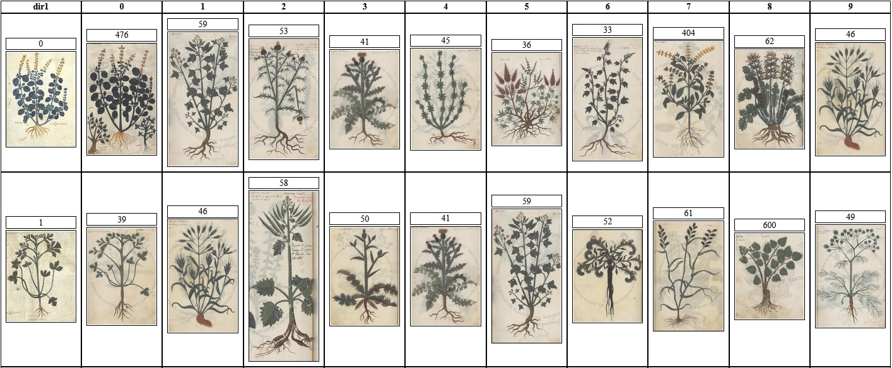
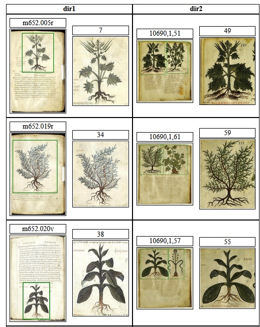
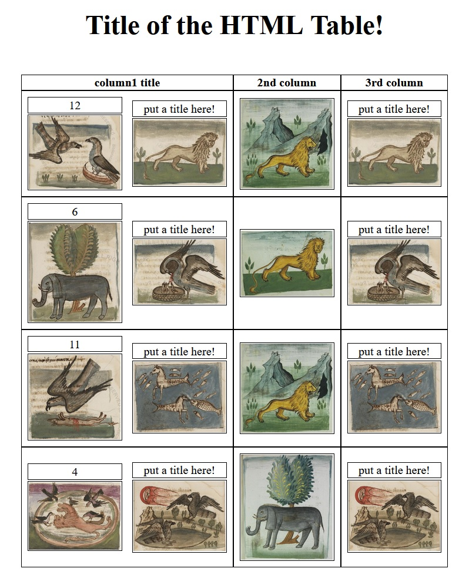
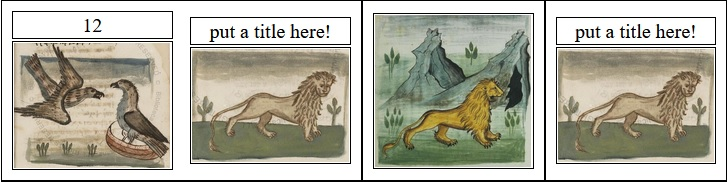

# Manuscript Tools

<p align="center">

</p>

## Presentation

Given two manuscripts, and their respective illustrations extracted, this algorithm will generate a set of web pages described in the next section. 

## Demo

This command can be immediatly run in the terminal. The web pages will be stored in a directory named "P2P3_web_pages" (created automatically).

```
python main.py -m1 "manuscripts_demo/P2/illustration" -m2 "manuscripts_demo/P3/illustration" -s "P2P3_score_matrix.npy" -r "P2P3_web_pages" -nn 5 --with_annotation
```

## The Result Pages

Once the computations are done, the algorithm will create several web pages to view the results:
- The data web pages: a table containing every illustration with and index.
- The extraction web pages: a table with three columns, showing you respectively, the page of the manuscript, the same page annotated, and the illustrations extracted from that page
- The matches web pages: a table with two columns, the first one contains every illustration of the manuscript, and in the second one the illustration of the second manuscript that has the highest similarity score with the first column illustration 
- The nearest neighbors web pages: a table with two columns, the first one contains the illustrations of the first manuscript, and the second the illustrations of the second manuscript that correspond the most, according to the algorithm
- The best matches web page: a table with two columns, the first one contains some illustrations of the first manuscript that have a match with some illustrations from the second manuscript, and the second column contains the matches in the second manuscript.
- (Optional) The annotation extraction pages: a table with 3 column, the first one contains the original folio, the second column contains the annotated folio, and the third column contains all the illustration extracted from that folio.

## Usage

### Basic usage
- Simply having 2 illustrations folders


### Optional usage
- Having 2 manuscripts images stored in folders (one folder per manuscript)
- In each manuscript folder, having subfolders named "annotated" and "illustration"

The "annotated" folder, contains every page of the manuscript, with rectangles drawn, representing the extraction.

The "illustration" folder, contains the illustrations found in the manuscript.

In that case the option `--with_annotation` explained in the next section will be available.
Also, it will create 2 more web pages: the annotation extraction page for the two manuscripts.

<p align="center">

</p>

## Command Line

```
python main.py -m1 m1_path -m2 m2_path -s score_matrix_npy_path -r result_dir_path -nn n_nearest_neighbor --with_annotation
```

**args**
- `-m1, --manuscript_1`: directory where the first manuscript is stored.
- `-m2, --manuscript_2`: directory where the second manuscript is stored.
- `-r, --result_dir`: directory in which the results will be stored at the end of the execution of the algorithm.
- `-s, --score_matrix`: path to the .npy file containing a 2D score matrix.
- `-nn, --nearest_neighbors_number`: number of nearest neighbors to display in the "nearest neighbors" web pages.
- `--with_annotation`: if specified, it will add the annotated images corresponding to each illustration (if the annotation directory exists).

## Example

In the root of the GitHub you can find an example python file "example.py".

Specify the manuscripts' path and the wanted result folder and the number of the nearest nighbors here:

```python
manuscript1_path = "manuscripts_demo/P2/illustration"
manuscript2_path = "manuscripts_demo/P3/illustration"
result_folder = "./P2P3_web_pages"
nn_number = 10
```

The script will compute a simple cosine similarity score matrix, using the pretrained resnet50 conv4 features.
It will then create all the set of pages and will save them in the result folder.

## TableHTML class

<p align="center">

</p>

The class TableHTML helps create quickly and easy a web page with a table containing images with their indexes.

To create the web page you need first to instantiate the class TableHTML, taking as argument the title of the web page you want to create.

```python
from utils.TableHTML import TableHTML
table = TableHTML('Title of the HTML Table!')
```

Then the columns title should be set with the method ```add_head```. It takes as argument a list of str. This method should be called only once.
```python
table.add_head(["column1 title", "2nd column", "3rd column"])
```

Then to add a row you need to use the method ```add_row``` that takes as argument a list.
This list should have as length the number of columns determined by the ```add_head``` method.

The elements of that list are whether :
- a tuple ```(idx, path)``` idx being the index of the image, and path being its path.
- a list of those tuples (then the images in that list will be in the same column).

```python
image1 = ("12", path1)
image2 = ("put a title here!", path2)
image3 = ("", path3)
row = [[image1, image2], image3, image2]
table.add_row(row)
```

<p align="center">

</p>

To then save the table, use the method ```save``` which takes as an argument the path of the html file.


```python
table.save("example/table.html")
```

And voilà the web page is created!

In the root of the GitHub you can find an example python file "create_html_table_example.py". This is a commented file that explains how to create a customizable table very quickly.
